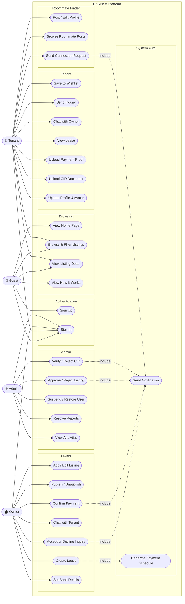
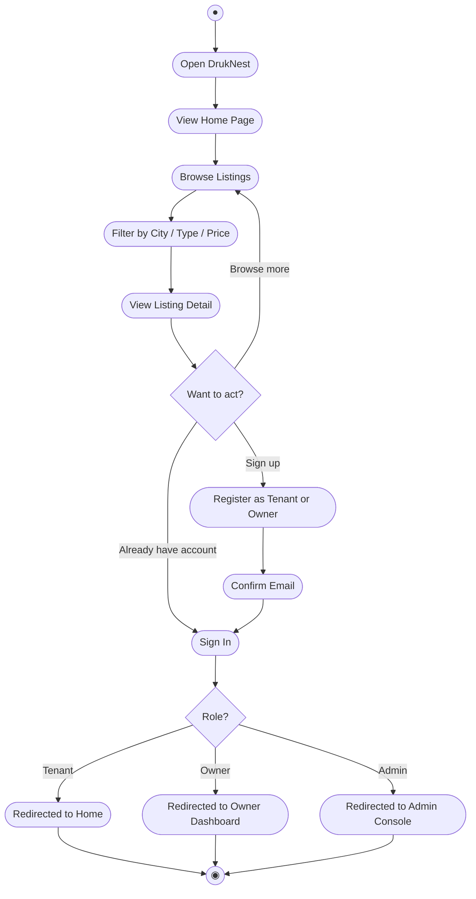
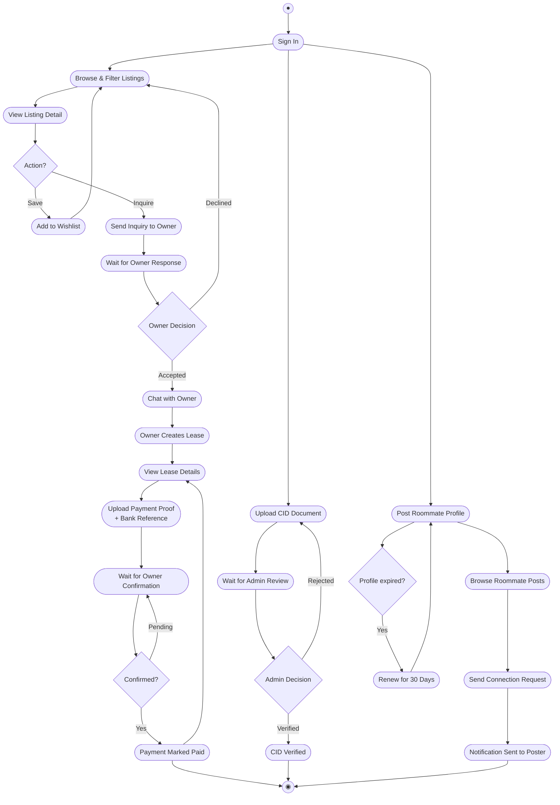
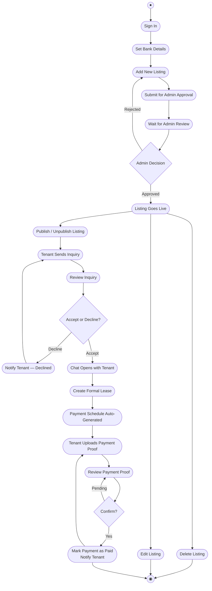
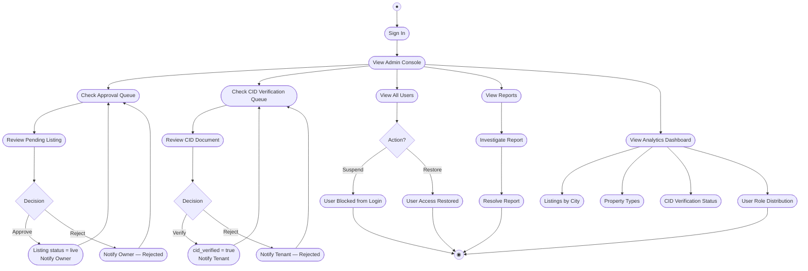
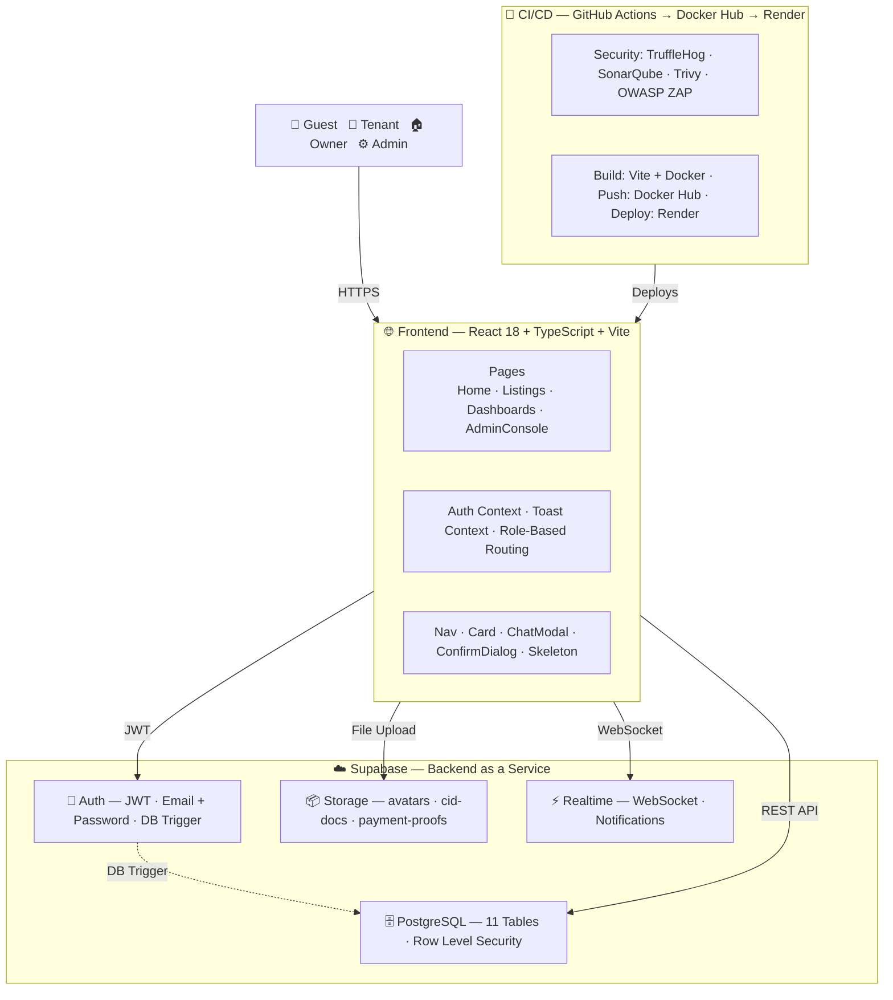

# DrukNest — Use Case Diagram

---

# Interaction Overview — Guest

---

# Interaction Overview — Tenant

---

# Interaction Overview — Owner

---

# Interaction Overview — Admin

---

# DrukNest — System Architecture

